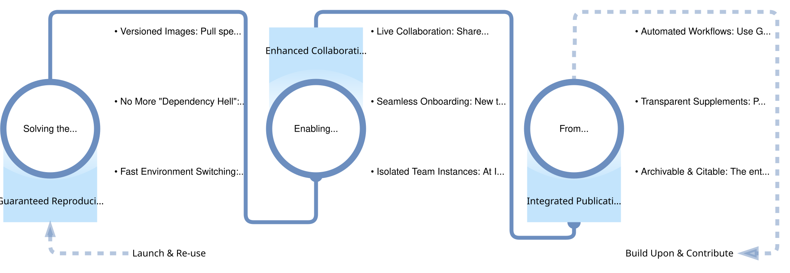

# Concept & Philosophy behind Carto-Lab Docker

On the surface, Carto-Lab Docker (CLD) is a tool that provides a JupyterLab environment. However, its true purpose is to implement a holistic **Research Data Management (RDM)** workflow designed specifically for the challenges of modern spatial data science. This page explains the "why" and "how" behind its design.

The core problem is that spatial science research is notoriously difficult to reproduce. It relies on complex software with fragile dependencies (the infamous "dependency hell" of GDAL, QGIS, etc.), making it a significant hurdle to share, reuse, and verify research outputs. CLD is our solution: an integrated system that embeds RDM best practices directly into the research lifecycle.

## Our Approach: A Three-Pillar RDM Infrastructure

Our RDM concept is built on three pillars that address the entire research process, from initial setup to final publication and beyond.

### 1. Guaranteed Reproducibility

**The Challenge:** Standard environment managers like `conda` or `pip` often fail to create identical environments over time, especially with the complex C-dependencies found in spatial software.

**The CLD Solution:** We treat the entire computational environment as a single, versioned artifact. Each release of Carto-Lab Docker is a "computational snapshot" packaged as a Docker image. This means you can pull a specific version (e.g., `v0.15.7`) years later and perfectly replicate the exact software environment in which a project was originally created. This is the cornerstone of long-term reproducibility.

Within this stable base, we provide two carefully curated environments for both Python and R, packed with major spatial packages chosen for compatibility and stability. We recognize that every project has unique dependencies, so CLD offers a flexible approach to adding more packages. Our recommended strategy offers a pragmatic trade-off between container immutability and development speed:

1. Selectively install packages directly within your notebooks. This method is fast, as it only adds what's needed instead of rebuilding an entire 100+ package environment. Critically, the installation code (e.g., `!pip install ...`) is version-controlled within the notebook itself, keeping the process transparent and reproducible.
2. For more complex needs, advanced options are also available, such as extending the base Docker image with custom layers or using persistent volumes. However, we find that the simple, in-notebook strategy is the most effective and straightforward solution for the majority of research workflows.

Read the documentation on package setup [here](environments.md).

### 2. Enhanced Collaboration

**The Challenge:** Scientific research is rarely a solo effort. Teams need effective ways to work together on code and narrative, and onboarding new members can be a time-consuming technical challenge.

**The CLD Solution:** CLD is built for team science. It includes features like live, real-time collaboration within a single Jupyter notebook, allowing multiple users to code and write simultaneously. For teams at IOER, we provide dedicated instances that eliminate setup for new members and get a pre-configured environment with Git access. This significantly reducing the learning curve and allows them to contribute from day one.

### 3. Integrated Publication

**The Challenge:** A published paper is often just the tip of the iceberg. The underlying code, data, and analytical narrative are crucial for transparency and reuse, but are often difficult to package and share.

**The CLD Solution:** CLD is designed to turn your research notebook into a **FAIR Digital Object**. By integrating with Continuous Integration / Continuous Deployment (CI/CD) pipelines (e.g., GitLab CI), CLD automates the process of converting a Jupyter Notebook into a versioned, static HTML website (see our [Biodiversity Training Materials](https://training.fdz.ioer.info/) as an example). This published output contains the code, the narrative, and the interactive visualizations, creating a complete, archivable, and citable replication package.

## Closing the Loop: From Publication to New Research

These three pillars combine to create a cyclical RDM workflow. The goal is not just to publish a static result, but to create a living document that serves as the starting point for the next wave of research.

As the diagram illustrates, the workflow doesn't end with publication. It creates a loop:

1.  **Launch & Re-use:** A researcher discovers your published work. Because it's fully reproducible, they can instantly launch the entire environment and analysis in their browser (e.g., via the Base4NFDI Jupyter Hub) without any local installation.

2.  **Build Upon & Contribute:** They can then pull the corresponding Carto-Lab Docker image to their own machine or environment to extend the analysis, fix a bug, or apply the methods to new data. Their new contribution can then be published, continuing the cycle of open, incremental scientific progress.

## Summary: RDM in Action

Carto-Lab Docker is more than just a tool—it's a workflow and a philosophy. By integrating environment management, collaboration, and publication, it embeds the principles of FAIR and Open Science directly into the daily work of researchers, turning good RDM practices from a theoretical ideal into a practical reality.