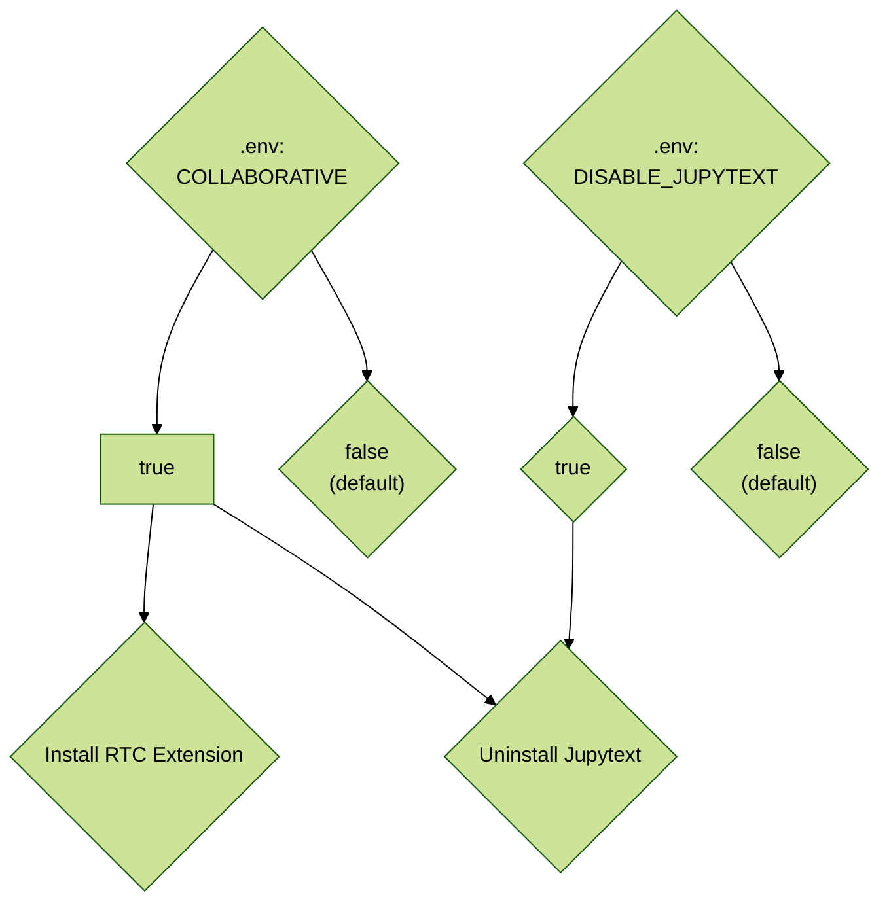

# Configuration

The following parameter can be set through editing the `.env` file:

## Carto-Lab Docker version tag

The Carto-Lab Docker version tag to use
e.g. TAG=v0.12.3; defaults to:
```bash
TAG=latest
```

!!! note
    It is always recommeneded to use an explicit version tag, e.g. `TAG=v0.16.3`.
    In this case, you can go back to the Carto-Lab Docker version that was used 
    to run specific notebooks.

After changing the version tag, use `docker compose pull` to update the docker container.

## Docker container name

The Docker container name, defaults to:
```bash
CONTAINER_NAME=lbsn-jupyterlab
```

## Docker network name

The Docker network to use, defaults to:
```bash
NETWORK_NAME=lbsn-network
```

## Postgres password

To access lbsn postgres db, provide a password, which
will be made available inside the container, so you can
access this from within your notebooks:
```bash
POSTGRES_PASSWORD=eX4mP13p455w0Rd
```

## Static Jupyter password

Optionally provide a static password
to access jupyter lab
```bash
JUPYTER_PASSWORD=eX4mP13p455w0Rd
```

## Adjust the startup folder for notebooks

Adjust the startup folder in jupyter lab
this folder will be available through a bind-mount. Default:
```bash
JUPYTER_NOTEBOOKS=${HOME}/notebooks
```

## Jupyter Web Port

Adjust the web port under which JupyterLab can be reached. Default:
```bash
JUPYTER_WEBPORT=8888
```

## Jupyter Web URL

Adjust the web url under which JupyterLab can be reached. 
e.g.: https://jupyterlab.example.org

Default:
```bash
JUPYTER_WEBURL=http://localhost/
```

## Override path to environment.yml

Optionally adjust path to `environment.yml`, e.g. to create
a custom env with other packages, e.g.
```bash
ENVIRONMENT_FILE=envs/environment_custom.yml
```

Default:
```bash
ENVIRONMENT_FILE=environment_default.yml
```

## Override worker environment name

This is the name of the default Kernel environment that can be selected in Jupyter.

Default:
```bash
WORKER_ENV_NAME=worker_env
```

## Link persistent conda environments

In order to allow other persistent environments to be used within the
Jupyter lab container, adjust the folder to link persistent conda environments.
This folder will be available through a bind-mount
```bash
CONDA_ENVS=${HOME}/envs
```

## Add Mapnik fonts folder

If using the Mapnik-Docker tag
add a folder to link external fonts
for mapnik
```bash
MAPNIK_FONTS=/usr/share/fonts
```

## Define compose file to use

Define the compose file to use,
default is `docker-compose.yml`.
E.g. to start the Mapnik version by default:
```bash
COMPOSE_FILE=docker-compose.mapnik.yml
```

## Enable collaboration support

Setting `COLLABORATIVE=true` will start the Jupyter server with [Real Time Collaboration (RTC)](/collaboration) extension enabled.

The default is `false`.

This _also_ requires that the jupytext extension is disabled,
as both extensions are incompatible.

```bash
COLLABORATIVE=true
```

Live collaboration has been successfully tested 
starting with Carto-Lab Docker 24.1.

This is the decision tree:



## Disable jupytext extension

```bash
DISABLE_JUPYTEXT=true
```

!!! note
    At the moment, disabling jupytext means that the extension will
    be uninstalled on runtime using conda. In our tests, simply disabling
    jupytext was not enough to solve the conflicts with the live
    collaboration extension. This means that setting `DISABLE_JUPYTEXT=true`
    can increase the startup time of Carto-Lab Docker.

## Disable jupyterlab-git extension

```bash
DISABLE_JUPYTERLAB_GIT=true
```

## Generate random token

To generate random token on startup,
in addition to the user password, set:
```bash
GENERATE_TOKEN=true
```

The token is exported as TOKEN variable
and available with `echo $TOKEN` in the server.

For signing into Jupyter Lab, you can then either use the token
or the password.

## Set Autoshutdown timeout

The default for Carto-Lab Docker is to shutdown automatically after 30 Minutes,
if no notebook kernels are running.

This can be adjusted with the following:
```bash
JUPYTER_AUTOSHUTDOWN_TIMEOUT=1800
```

!!! note
    To disable auto-shutdown, set `JUPYTER_AUTOSHUTDOWN_TIMEOUT=0`.

