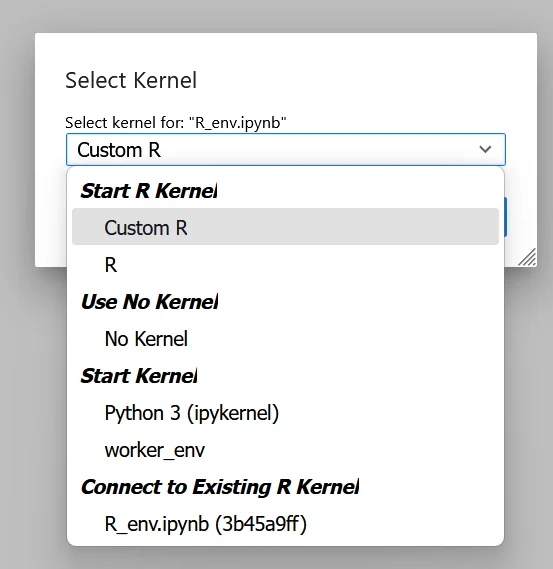

# Managing Environments

Carto-Lab Docker provides a stable, versioned base with curated Python and R environments (`worker_env` and `r_env`). While this foundation covers many use cases, research is dynamic and often requires specific packages or versions.

This guide presents four methods for customizing your environment. They are ordered from the simplest and most common approach to the most advanced, each with different trade-offs in terms of ease of use, persistence, and long-term reproducibility.

---

## Method 1: In-Notebook Package Installation (Recommended)

This is the most straightforward and flexible method for adding packages for a specific project. You install what you need directly from a Jupyter Notebook cell.

### How it works

Use `!pip install` or `!conda install` at the beginning of your notebook. The `!` tells Jupyter to run the command in the shell.

```python
# Example: Installing a specific package with pip
!/opt/conda/envs/worker_env/bin/python -m pip install geoplot alphashape

# Example: Installing a package with conda
!conda install -n worker_env hdbscan -c conda-forge -y
```

#### Pros

-   **Simple & Fast:** No Docker knowledge required. You only install the specific packages you need, which is much faster than rebuilding a full environment.
-   **Transparent & Reproducible:** The installation command is saved as a code cell within the notebook. Anyone re-running your notebook will automatically create the exact same environment state. To maximize reproducibility, it is best practice to specify exact package versions (e.g., `pip install package==0.5.0`).

#### Cons

-   **Temporary:** The installed packages are lost when the Docker container is restarted. The installation command must be re-run each time the notebook kernel is started. This is usually acceptable if you have only a few additional packages, but becomes cumbersome and inefficient if you need many custom packages.

!!! tip
    See an example [in this notebook](https://kartographie.geo.tu-dresden.de/ad/wip/ephemeral_events/html/03_wikidata_event_query_nevada.html),
    where a further check is used to prevent re-installation, if the package or environment already exists.

    In [this notebook](https://kartographie.geo.tu-dresden.de/ad/wip/mapnik_stablediffusion/html/03_map_processing.html), a helper script `pkginstall.sh`
    is used to reduce the effort for maintaining environments and package installs. Find the tool in [this repository](https://gitlab.hrz.tu-chemnitz.de/s7398234--tu-dresden.de/base_modules).

### Use Case: Using a specific `geopandas` version for a project

A colleague needs to run a legacy script that requires `geopandas` version `0.10.2`.

1.  **Check the current version** in a notebook cell (`worker_env` active):

```python
import geopandas
print(geopandas.__version__)
```

2.  **Install the specific version.** Add this cell at the top of the notebook:

```python
# The '-y' flag automatically confirms the installation
!conda install -n worker_env geopandas=0.10.2 -c conda-forge -y
```

After the installation, you must **restart the kernel** for the change to take effect.

3.  **Verify the new version** by re-running the check command.

!!! tip "Need a different R version?"
    Changing the version of a complex package like R using this in-notebook method is not recommended, as it can be slow and unstable.
    
    **The correct and robust solution is to create a dedicated, persistent environment.** Please see the detailed guide for this under **[Method 2: Creating Persistent Custom Environments](#method-2-creating-persistent-custom-environments)**.

---

## Method 2: Creating Persistent Custom Environments

This method is ideal when you frequently need a stable, customized environment for a longer-term project and don't want to reinstall packages every time. It uses a "bind mount" to store the environment outside the container.

The core idea is to create a new environment inside a folder on your host machine that is mapped into the container (by default, this is `/envs/`). You then link this new environment as a kernel in JupyterLab.

### Using Conda (Recommended)

This is the most robust method as Conda can manage Python, R, and complex non-Python dependencies.

1.  **Open a Terminal in JupyterLab.**

2.  **Create a new environment** with the `--prefix` pointing to the `/envs/` directory. You must include `ipykernel`.

```bash
conda create \
    --prefix /envs/my_custom_env \
    --channel conda-forge \
    pip numpy pandas ipykernel
```

3.  **Activate the environment and link the kernel** so JupyterLab can find it. This only needs to be done once.

```bash
conda activate /envs/my_custom_env
python -m ipykernel install --user --name="My Custom Env"
conda deactivate
```

4.  **Refresh your browser** (<kbd>F5</kbd>). You can now select "My Custom Env" as a kernel in your notebooks.

### Alternative: Using Python's `venv`

For purely Python-based environments, `venv` is a lightweight alternative built into Python. You can run these commands directly from a notebook cell.

#### 1.  **Create a new `venv` environment** inside the persistent `/envs/` directory.

```bash
!python -m venv /envs/wikidata_venv
```

!!! note
    The `!` at the beginning of a line in a notebook cell tells Jupyter to run it as a shell command.

#### 2.  **Install packages** into the new environment. Make sure to include `ipykernel`.

```bash
!/envs/wikidata_venv/bin/python -m pip install qwikidata ipykernel pandas
```

#### 3.  **Register the new environment** as a Jupyter kernel.

```bash
!/envs/wikidata_venv/bin/python -m ipykernel install --user --name=qwikidata
```
    
After running this, refresh your browser (<kbd>F5</kbd>) and the new "qwikidata" kernel will be available for selection in your notebooks.

!!! warning "Reproducibility is Your Responsibility"
    This method provides persistence, but it breaks the perfect reproducibility guarantee of the base Carto-Lab Docker image. You are now responsible for documenting and sharing your custom environment. For Conda, export your environment with `conda env export`:
    
    `conda env export --prefix /envs/my_custom_env > my_custom_env.yml`

    For `venv`, generate a `requirements.txt` file (`pip freeze > requirements.txt`) and commit it to Git.

### Use Case: Installation of a specific R for a long-term project

**Prerequisite:** You are using the `r` Tag for Carto-Lab Docker.

!!! note
    Get the current R version from inside a notebook cell with `R.version.string`. This will output (e.g.) `'R version 3.6.3 (2020-02-29)'`.

---

#### **1. Open a new terminal in your Jupyter web interface**

#### **2. Activate the `r_env`**

```bash
conda activate r_env
```

#### **3. Get the current R-version**

```r
R --version
```

> R version 4.4.1 (2024-06-14) -- "Race for Your Life"

---

#### **4. Create a new R-Env with a custom R-Kernel version**

Below, the specific version `4.2.3` is specified:

```bash
conda deactivate
conda create \
    --prefix /envs/custom_r_env \
    --channel conda-forge \
    r-base=4.2.3
conda activate /envs/custom_r_env
R --version
```

Example output:

> R version 4.2.3 (2023-03-15) -- "Shortstop Beagle"

---

#### **5. Link the custom env kernel to Jupyter**

First, install the R kernel package from within R:

```r
R
install.packages('IRkernel')
```

Exit the R session with <kbd>CTRL+D</kbd>.


Now, link the new custom R kernel with a Jupyter kernelspec:

```bash
# Add Carto-Lab jupyter's bin path to the end of PATH
export PATH="$PATH:/opt/conda/envs/jupyter_env/bin"

# Run the installspec command
Rscript -e "IRkernel::installspec(name='custom_r_env', displayname='Custom R', user=TRUE)"

# Deactivate R environment
conda deactivate
```

---

#### **6. Verify**

Refresh your browser with <kbd>F5</kbd>.

Create a new Jupyter notebook and select the new `Custom R` kernel.



Start working with your custom R env!

---

#### **7. Additional Steps**

After each Carto-Lab Docker update, the custom kernel environment may need to be *re-linked*.

You can do this by including the following commands in an R cell at the top of your notebooks:

```r
# Extend PATH so IRkernel can find jupyter
Sys.setenv(PATH = paste(Sys.getenv("PATH"), "/opt/conda/envs/jupyter_env/bin", sep = ":"))

# Link the kernel
IRkernel::installspec(name = "custom_r_env", displayname = "Custom R", user = TRUE)
```

---

#### **8. Backup the Environment for Reproducibility**

To preserve installed package versions, you can back up the environment using Conda:

In an R cell, run:
```r
system("conda env export > custom_r_env.yml")
```

This generates a YAML file (`custom_r_env.yml`) that includes:

- All Conda packages (including `r-*` R packages)
- Version constraints
- The name of the environment
- The channels used to install the packages

To restore the environment, open a terminal and run:

```bash
conda env create -f custom_r_env.yml
```

This will recreate the environment with similar versions.

---

**For Exact Reproducibility:**

If you require full reproducibility down to the exact build hash (e.g. for archival or deployment), use:

```r
system("conda list --explicit > custom_r_env.txt")
```

To restore:

```bash
conda create --name restored_env --file custom_r_env.txt
```

This installs exact builds (requires the original channels to still be available).

!!! tip
    Add your `custom_r_env.txt` and `custom_r_env.yml` to git, to track any changes
    and version your dependencies.

!!! warning "A Note on Container Updates and Stability"
    A custom Conda environment stored in a bind mount is persistent, but **it is not fully isolated** from the container's underlying operating system. Conda can link against system-level libraries provided by the container.

    This means that if you update Carto-Lab Docker to a newer version, a custom environment created with an older version may become unstable or fail to run.

    The most reliable way to ensure your custom environment always works is to **pair it with the specific Carto-Lab Docker version it was created with.** Since we archive every version in our container registry, you can simply pull the original container tag (e.g., `v0.28.0`) to guarantee a fully functional setup. While exporting and recreating your environment from a `.yml` file can help with migrating notebooks, it is not guaranteed to work across major container updates. The safest method remains pairing your custom environment with its original Carto-Lab Docker version.

### Advanced Archiving and Sharing of Custom Environments

While `conda env export > my_env.yml` is great for documenting an environment's dependencies, it requires a slow re-installation process and relies on external package sources. For sharing a complete, ready-to-run environment, there are two more robust methods.

---

#### Option A: Simple Archive (For Carto-Lab Docker Users)

This is the simplest and fastest way to share a custom environment **with other Carto-Lab Docker users**.

This method works because Carto-Lab Docker provides a crucial guarantee: every user running the same version tag (e.g., `v0.28.0`) has an identical underlying system. As long as the environment path is also kept consistent (e.g., `/envs/my_custom_env`), a simple compressed archive will be perfectly relocatable between users.

**1. Create the Archive**
From a terminal *inside* your Carto-Lab Docker container, navigate to your persistent environments folder and create a `tar.gz` archive of your custom environment.
```bash
cd /envs/
tar -czf my_custom_env.tar.gz my_custom_env
```
You can now share this `my_custom_env.tar.gz` file with a colleague.

**2. Restore the Archive**

Your colleague, running the **exact same version of Carto-Lab Docker**, can restore the environment by unpacking the archive into their `/envs/` directory.
```bash
# From within their container's terminal
cd /envs/
tar -xzf /path/to/my_custom_env.tar.gz
```

The environment is now ready to be used immediately, with no re-installation required.

!!! success "The Power of a Stable Base"
    This simple workflow is a direct benefit of Carto-Lab Docker's versioning. It bypasses Conda's usual non-relocatability issues because the container provides a perfectly stable and consistent context.

---

#### Option B: `conda-pack` (For Sharing Outside Carto-Lab Docker)

This method should be used when you need to share your environment with someone who is **not** using the exact same Carto-Lab Docker setup, or if the environment needs to be deployed to a different path or system (e.g., an HPC cluster).

[`conda-pack`](https://conda.github.io/conda-pack/) creates a truly relocatable archive by bundling the environment and providing a script to fix hard-coded paths upon unpacking.

**1. Install `conda-pack`**
First, install `conda-pack` into the base Conda environment within the container. You only need to do this once.
```bash
conda install -c conda-forge conda-pack
```

**2. Pack Your Custom Environment**
Use the `--prefix` option to target your environment.
```bash
conda pack --prefix /envs/my_custom_env -o my_custom_env.tar.gz
```

**3. Unpack and Use the Environment**

On the target machine, the user unpacks the archive and runs a special command to fix the paths.

```bash
mkdir -p /some/new/path/my_env
tar -xzf my_custom_env.tar.gz -C /some/new/path/my_env
source /some/new/path/my_env/bin/activate
conda-unpack # This is the crucial step
```

After running `conda-unpack`, the environment is fully functional in its new, arbitrary location.

#### Summary: Choosing the Right Archiving Method

Each method for archiving and sharing a custom environment has clear trade-offs. Use this summary to choose the best option for your specific needs.

| Method | Pros | Cons |
| :--- | :--- | :--- |
| **`environment.yml`** | • Smallest file size<br>• Human-readable<br>• Tracks dependencies, not binaries | • Slowest to restore (full re-install)<br>• Requires internet access<br>• Can fail if packages become unavailable (rare)|
| **Simple Archive (`tar`)** | • Fastest to restore<br>• Fully self-contained (no internet needed)<br>• Very simple commands | • **Not relocatable:** Only works if the CLD version <br>and path are identical<br>• Large file size |
| **`conda-pack`** | • Truly relocatable to any path<br>• Fully self-contained<br>• Fast to restore | • Requires `conda-pack` tool<br>• More complex restore process (`conda-unpack`)<br>• Large file size |

!!! success "Recommendation"
    *   **For documenting dependencies** in a Git-based workflow, use **`environment.yml`** or **`requirements.txt`**.
    *   **For quickly sharing environments with other Carto-Lab users** on the same version, the **Simple Archive** is the most efficient method.
    *   **For long-term archival** or sharing with the **broader community** (e.g., on an HPC cluster), **`conda-pack`** is the most robust solution.

---

## Method 3: Extending the Base Image (Custom Dockerfile)

This is the power-user method for creating a new, fully reproducible, and distributable version of Carto-Lab Docker with your customizations baked in.

#### How it works

You write a new `Dockerfile` that uses the official Carto-Lab Docker image as its base. You then add `RUN` commands to install your dependencies, build the new image, and push it to a registry.

```dockerfile
# Use an official Carto-Lab Docker image as the base
FROM gcr.hrz.tu-chemnitz.de/ioer/fdz/carto-lab-docker:latest

# Add your custom installation commands
RUN conda install -n worker_env -c conda-forge my-special-package -y && \
    # Clean up conda cache to keep image size down
    conda clean --all -y
```

!!! tip
    Have a look at how we use this method to create our official Mapnik variant in the [mapnik/Dockerfile](mapnik/Dockerfile):

<details>
    <summary style="cursor: pointer;">See the mapnik/Dockerfile<br><br></summary>

```yaml
{!../mapnik/Dockerfile!}
```

<br><br>
</details>

#### Pros

*   **Fully Reproducible & Distributable:** The new environment is a versioned Docker image, just like the official one. You can share it with colleagues via a registry, guaranteeing everyone has the exact same setup.
*   **Best Performance:** All packages are pre-installed, so there is no installation delay at runtime.

#### Cons

*   **Requires Docker Knowledge:** You need to be comfortable with building and managing Docker images.
*   **Requires a Registry:** To share the image, you need access to a container registry.

#### Use Case: Providing a specific R version for an entire team

If a whole research group needs to standardize on R 3.6, the administrator can create a custom image (`my-registry/carto-lab-docker:latest-r3.6`) and make it available to everyone. This is the most robust solution for team-wide standardization.

---

## Method 4: Snapshotting a Live Container with `docker commit`

This advanced method is useful for **archiving an exact state** after an interactive session of trial-and-error, rather than for planned environment setup.

#### How it works

After making changes inside a running container (e.g., installing packages, modifying configuration files), you can create a new image from that container's state using the `docker commit` command from your _host_ machine's terminal.

1.  **Find the Container ID:** List all running containers to find the ID of your Carto-Lab Docker instance.

```bash
docker ps
```

2.  **Commit the Changes:** Use the container ID to create a new image.

```bash
docker commit <container_id> my-username/carto-lab-docker:snapshot-YYYY-MM-DD
```

3.  **Push to a Registry (Optional):** You can now push this new image to a registry for archival.

```bash
docker push my-username/carto-lab-docker:snapshot-YYYY-MM-DD
```

#### Pros

*   **Perfect Snapshot:** Captures the exact state of a container at a specific moment in time, which is great for debugging or archiving a "working state."

#### Cons

!!! danger "Reproducibility Anti-Pattern"
    While it captures a state, `docker commit` is often considered an anti-pattern because the changes are not documented in code (like a Dockerfile). The resulting image layer is a "black box," making it very difficult to know what changed or to automate the process. **Use this method for archival or debugging, not for primary environment creation.**

#### Use Case: Archiving a successful but complex analysis

A researcher finally gets a complex model to run after hours of interactive package installations and tweaks. To ensure they can always return to this exact "eureka" moment, they use `docker commit` to create a permanent, personal snapshot of the container for their records.