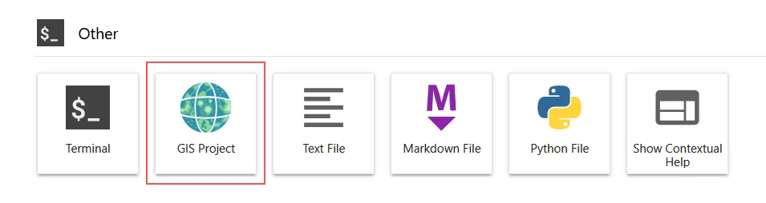

# JupyterGIS

Carto-Lab Docker includes JupyterGIS in its server environment (`jupyter_env`), as of version v1.1.0. This allows creating and opening JupyterGIS projects. Because Carto-Lab separates the JupyterLab interface (`jupyter_env`) from execution kernels (`worker_env`):

- The GIS editor, QGIS compatibility, and collaborative map visualizer are fully active in the browser because they run inside `jupyter_env`
- If you want to use the jupytergis Python API inside a Jupyter Notebook (e.g. programmatically building maps via Python code), you will need to add `jupytergis` to your working environment as well. Currently, jupytergis is not made available by default in the `worker_env`.

## How to use

Start or create a JupyterGIS project in the Launcher:

!!! tip
    Read the [Getting Started with JupyterGIS](https://jupytergis.readthedocs.io/en/latest/user_guide/tutorials/01-intro/) if you want to know how to use this package. JupytwerGIS also features [Real Time Collaboration](https://jupytergis.readthedocs.io/en/latest/user_guide/tutorials/02-collaboration/index.html), so you can share your session with colleagues to co-edit GIS projects.

    <video
    class="content bg"
    style="object-fit: cover;height: 100%;width: 100%;left: -10%;top:-10%;border: 1px solid rgba(0,0,0,0.25);"
    playsinline
    autoplay
    muted
    loop
    controls
    poster="/jupytergis.webp"
    id="collaborationvideo">
    <source src="/jupytergis.webm" type="video/webm">
    </video> 