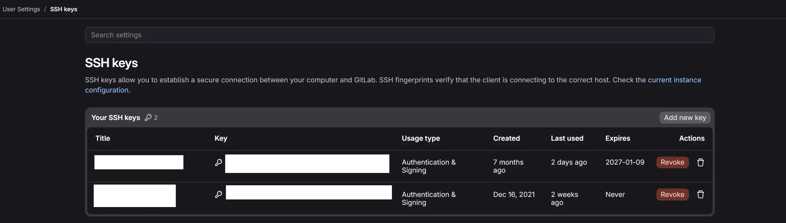

# SSH Client Authentication

Carto-Lab Docker allows users to authenticate with external Git repositories (e.g., GitLab) securely using SSH Deploy Keys or Personal SSH Keys. This avoids exposing private access tokens in plaintext URLs and prevents repetitive passphrase prompts during a session.

This guide explains how to configure SSH authentication by mounting configuration files directly via `docker-compose.yml`. This requires no changes to the base container image.

!!! note
     SSH Client Authentication is supported by Carto-Lab v1.1.0 onward.

!!! info "Deployment Context"
    This guide assumes your Carto-Lab environment is hosted on a remote server or VM, as is described with our standard setup using our [Ansible Deployment strategy](../ansible.md). 
    
    If you are running Carto-Lab locally on your own laptop (e.g., via Docker Desktop), you can still use this guide to make a host ssh key available inside your container. However, you will need to adapt paths/host context to your specific setup.

---

## 1. Administrator Setup (Host Machine)

These steps are performed on the host machine running Docker to generate the necessary keys and mount them into the container environment.

Create a new Ed25519 SSH key specifically for this Carto-Lab environment. We recommend leaving the passphrase empty for containerized keys.

```bash
ssh-keygen -t ed25519 -f ~/.ssh/jupyter_deploy_key -C "jupyter-container-bot" -N ""
```

!!! warning "Security Implications of a Password-less Key"
    We strongly recommend using a **password-less** key for this setup. Because this is a dedicated key strictly scoped to a single container (and not your personal laptop key), using a password-less key is the industry standard for automated/containerized environments. 
    
    It allows the JupyterLab visual Git extension and automated scripts to work immediately without manual unlocking. Ensure you enforce strict file permissions on the host machine to protect this key at rest.

Set strict file permissions. SSH will reject the key if permissions are too open:
```bash
chmod 600 ~/.ssh/jupyter_deploy_key
```

**Create an SSH Config File**

Create a configuration file to map the key to your Git host and automatically accept host fingerprints:

```bash
nano ~/.ssh/jupyter_ssh_config
```

Add the following content. Replace `gitlab.hrz.tu-chemnitz.de` with your actual Git domain; you can add multiple, including `github.com`:
```text
Host gitlab.hrz.tu-chemnitz.de
  IdentityFile /root/.ssh/id_ed25519
  StrictHostKeyChecking accept-new

Host github.com
  IdentityFile /root/.ssh/id_ed25519
  StrictHostKeyChecking accept-new
```

!!! tip "Watch out for typos"
    Ensure the `IdentityFile` path exactly matches the path *inside* the container (`/root/.ssh/id_ed25519`). Do not include Docker volume flags (like `:ro`) in this text file, as SSH will treat it as part of the filename and fail.


### Applying the Mounts

Depending on how your environment is deployed:

**Option A: Managed Multi-User Servers (Ansible Automated)**

If your server is managed via our [Ansible Deployment](../ansible.md) workflow, **no manual Docker Compose editing is required.**

Simply run the reconciliation playbook on your control machine:
```bash
ansible-playbook 2.1_reconcile_cartolab.yml \
  -l <target_host> --vault-id shared@prompt --vault-id hosts@prompt
```

Ansible will automatically detect the new `jupyter_deploy_key` in the user's `.ssh` directory, inject the volume mounts into `docker-compose.override.yml`, and restart the container with the key mounted to `/root/.ssh/id_ed25519:ro`.

**Option B: Standalone / Local Instances (Manual Docker Compose)**

If running a standalone instance, add the mounts to **`docker-compose.override.yml`**:

```yaml
# docker-compose.override.yml
services:
  jupyterlab:
    volumes:
      - ~/.ssh/jupyter_deploy_key:/root/.ssh/id_ed25519:ro
      - ~/.ssh/jupyter_ssh_config:/root/.ssh/config:ro
    environment:
      - GIT_USER_NAME=${GIT_USER_NAME:-Jupyter Container Bot}
      - GIT_USER_EMAIL=${GIT_USER_EMAIL:-bot@fdz.ioer.info}
```

In your host's `.env` file, you can optionally override the fallback identities:

```bash
GIT_USER_NAME="Carto-Lab User"
GIT_USER_EMAIL="user@example.com"
```

Apply the changes:
```bash
docker compose up -d
```

---

## 2. Register the Key in GitLab

Before the container can use the key, the public half must be authorized in GitLab. 

Output the public key on the host machine and copy it:
```bash
cat ~/.ssh/jupyter_deploy_key.pub
```

How you register the key depends on how the container is being used:

### Scenario A: Personal User Workspace (Recommended)

If this Carto-Lab environment is dedicated to a specific user, the key should be tied to their personal GitLab account. This ensures all CI/CD pipelines and pushes are correctly attributed to them.

1. Send the copied public key to the user.
2. Have the user log into GitLab and navigate to **Profile/Edit Profile** → **Access → SSH Keys** (or go directly to `/-/user_settings/ssh_keys`).
3. The user pastes the key into the "Key" field and clicks **Add new key**.

  
_Fig.: Multiple SSH Keys added in Gitlab._

### Scenario B: Shared Bot / Automation Workspace

If this environment is for an automated pipeline or shared service account, add it as a Project Deploy Key.

!!! note
    CI/CD pipelines triggered by this key will show the avatar of the administrator who adds it.

1. In GitLab, navigate to your target project → **Settings** → **Repository** → **Deploy Keys**.
2. Paste the key, enable **Write access allowed**, and click **Add key**.

---

## 3. User Workflow (Inside Carto-Lab)

Because Carto-Lab automatically configures your Git identity variables on startup, no manual setup is required inside the container if you used a password-less key!

You can immediately use `git push`, `git fetch`, or the JupyterLab visual Git extension. SSH will automatically read the mounted key, and Git will use your injected name and email.

**Using the Git Extension & Terminal**

If you followed the guide and created a **password-less** key, you are completely finished! You can immediately use `git push`, `git fetch`, or the JupyterLab visual Git extension without any further configuration. SSH will automatically read the mounted key.

!!! info "Using a Password-Protected Key (Optional)"
    If you chose to secure your deploy key with a passphrase, the visual Git extension will fail until the key is unlocked. 
    
    Carto-Lab runs a global background SSH agent. You only need to unlock the key **once per container restart**. Open a single terminal in JupyterLab and run:
    

        ssh-add -t 28800 /root/.ssh/id_ed25519

    
    Enter your passphrase. Because the agent is shared globally across the container, the visual Git extension and all other terminal tabs will instantly have access to the unlocked key.